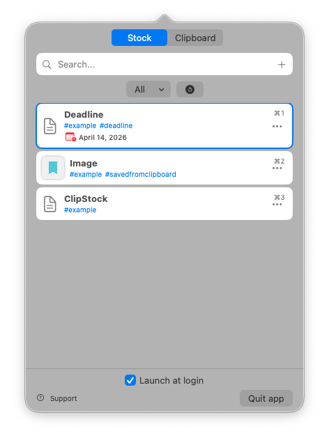
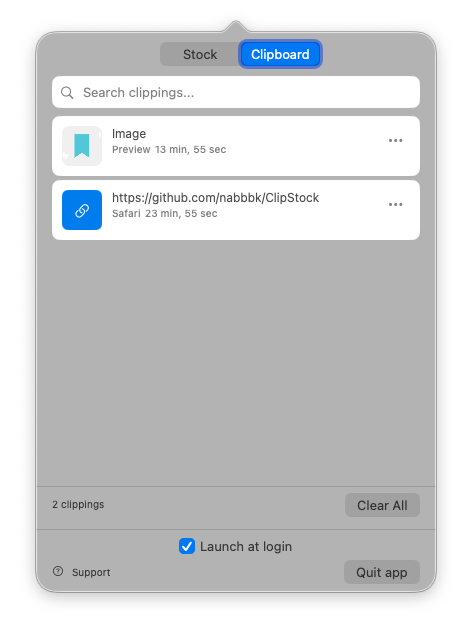

# ClipStock

A macOS menu bar app for saving URLs, files, text, and clipboard history — all accessible from your system tray.

## Features

### Stock Tab
- **Drag-and-drop** URLs, files, or text onto the menu bar icon to save them
- **Manual add** with multi-line text input
- **Search** saved items by name or tag
- **Tags** for organizing items
- **Due dates** with overdue indicators
- **Drag to reorder** — rearrange items by dragging
- **iCloud link sharing** for files in iCloud Drive
- **Tap to copy** any item to clipboard

### Clipboard Tab
- **Auto-capture** — automatically saves everything you copy (text, links, images)
- **Search** clipboard history
- **Save to Stock** — promote important clips to permanent storage
- **Drag-and-drop** clippings into any app
- **Smart deduplication** — copying the same text moves it to the top instead of creating duplicates
- **Pinned items** — keep important clips at the top; pinned items are exempt from the history limit
- **Quick copy** — `⌘1`–`⌘9` copies the Nth visible clip (Maccy-style)
- **Plain text copy** — `⌥⌘C` strips formatting from the selected clip
- **Configurable history limit** — default 500, adjustable in Preferences
- **Self-aware** — doesn't re-capture copies made from within the Clipboard tab
- **Encrypted at rest** — clipboard contents are stored with AES-GCM encryption using a 256-bit key kept in your macOS Keychain
- **Respects password managers** — pastes marked with `org.nspasteboard.ConcealedType` (1Password, Bitwarden, etc.) are never recorded

### General
- **Preferences window** — rebind global shortcuts, configure behavior; open via right-click on the menu bar icon
- **Paste on select** (optional) — automatically pastes the chosen clip into the frontmost app, mirroring Maccy (requires Accessibility permission)
- **Launch at login** via macOS native `SMAppService`
- **Localized** in English and Korean
- **Core Data** storage (CloudKit-ready for cross-device sync)

## Screenshots

| Stock Tab | Clipboard Tab |
|:-:|:-:|
|  |  |

## Keyboard Shortcuts

### Global (works from any app)

| Shortcut | Action |
|---|---|
| `Ctrl+Shift+V` | Open Stock tab |
| `Ctrl+Shift+C` | Open Clipboard tab |

Both shortcuts are remappable in **Preferences** (right-click the menu bar icon → **Preferences…**).

### Navigation (when popover is open)

| Shortcut | Action |
|---|---|
| `↑` / `↓` | Navigate items |
| `Shift+↑` / `Shift+↓` | Extend selection |
| `Tab` / `←` / `→` | Switch between Stock/Clipboard |
| `Enter` / `Cmd+C` | Copy selected item and close popover |
| `Esc` | Unfocus search field / Close popover |
| `Cmd+F` | Focus search field |
| `Cmd+1` … `Cmd+9` | Copy the Nth visible item and close popover |

### Stock Tab

| Shortcut | Action |
|---|---|
| `Cmd+N` | Add new item |
| `Cmd+E` | Edit item |
| `Cmd+D` | Add/edit deadline |
| `Cmd+Shift+D` | Remove deadline |
| `Cmd+Backspace` | Delete selected |

### Clipboard Tab

| Shortcut | Action |
|---|---|
| `Cmd+S` | Save selected to Stock |
| `Cmd+P` | Pin / unpin selected clip |
| `Option+Cmd+C` | Copy selected clip as plain text (strip formatting) |
| `Cmd+Backspace` | Delete selected |

### Dialogs

| Shortcut | Action |
|---|---|
| `Enter` | Confirm |
| `Shift+Enter` | Line break (in text fields) |
| `Tab` | Navigate between fields/buttons |
| `Esc` | Cancel |

## Install

1. Download `ClipStock.dmg` from the [latest release](https://github.com/nabbbk/ClipStock/releases/latest)
2. Open the DMG and drag ClipStock to Applications
3. Remove the quarantine flag (required for unsigned apps):
   ```
   xattr -cr /Applications/ClipStock.app
   ```
4. Launch ClipStock from Applications

> **Note:** The app is not notarized. If macOS blocks it, right-click the app → **Open** → **Open** to bypass Gatekeeper.

## Requirements

- macOS 13.0 (Ventura) or later
- Xcode 15+ to build from source

## Build from Source

1. Clone the repo
2. Open `ClipStock.xcodeproj` in Xcode
3. Select your Development Team in Signing & Capabilities
4. Build & Run (Cmd+R)

### CloudKit Sync (Optional)

To enable cross-device sync, change one line in `StorageHelper.swift`:

```swift
// Change this:
let container = NSPersistentContainer(name: "ClipStock")
// To this:
let container = NSPersistentCloudKitContainer(name: "ClipStock")
```

Then add iCloud + CloudKit entitlements in Xcode. Requires a paid Apple Developer account.

> **Note on encryption + CloudKit:** the clipboard encryption key lives in the local Keychain with `kSecAttrSynchronizable = false`, so it does not sync across devices. If you enable CloudKit, each device will have its own key and won't be able to decrypt the other's clips. Enabling CloudKit sync while keeping encryption at rest would require a dedicated key-sync mechanism that isn't currently implemented.

## Acknowledgments

This project is inspired by and based on [ItemStock](https://github.com/mszpro/ItemStock) by [@mszpro](https://github.com/mszpro) (Shunzhe Ma). The original app provided the foundation for the stock/save functionality. ClipStock is a modernized rewrite with added clipboard management features.

## What's Different from the Original

- Modernized to SwiftUI App lifecycle with `@NSApplicationDelegateAdaptor`
- Added clipboard history manager with auto-capture
- Replaced `LaunchAtLogin` dependency with built-in `SMAppService`
- Replaced deprecated `kUTTypeImage` with `UTType.image`
- Added Korean localization (original had Japanese)
- Tabbed interface (Stock / Clipboard)
- In-app toast notifications
- Sheet-based dialogs
- Preferences window with remappable global shortcuts (`KeyboardShortcuts`)
- Full keyboard shortcut system with multi-selection
- Drag-to-reorder stock items
- Pinned clips, `⌘1`–`⌘9` quick copy, `⌥⌘C` plain text copy
- Optional paste-on-select using `CGEvent` (Accessibility permission required)
- Removed read/unread tracking (unnecessary for clipboard manager use case)
- Clipboard history encrypted at rest (AES-GCM + Keychain-backed key); honors nspasteboard.org privacy types

## License

This project is licensed under the **GNU General Public License v3.0** — see the [LICENSE](LICENSE) file for details.

The original [ItemStock](https://github.com/mszpro/ItemStock) is also licensed under GPL-3.0.
